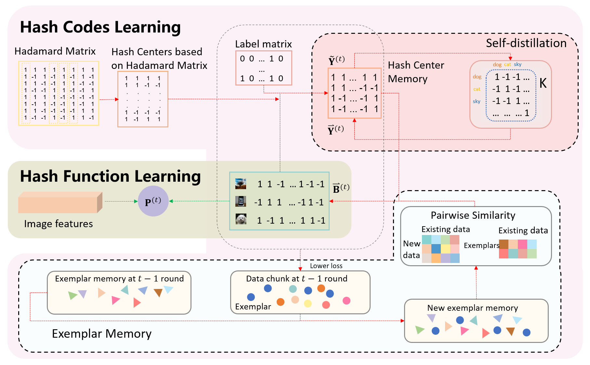
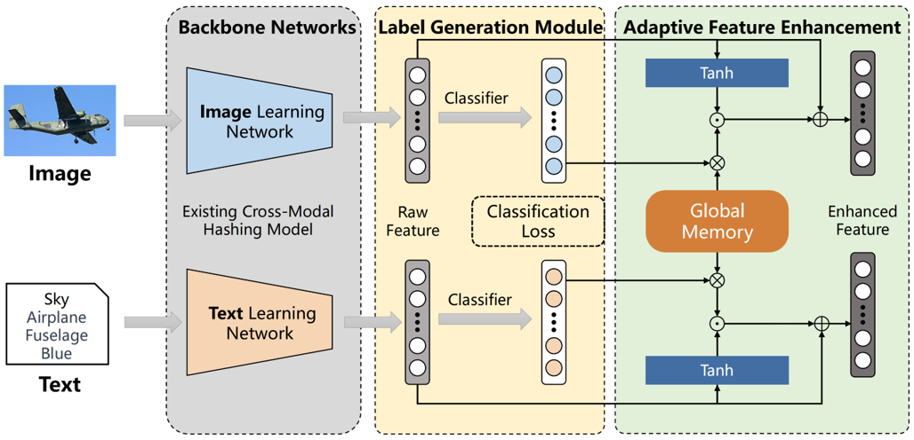
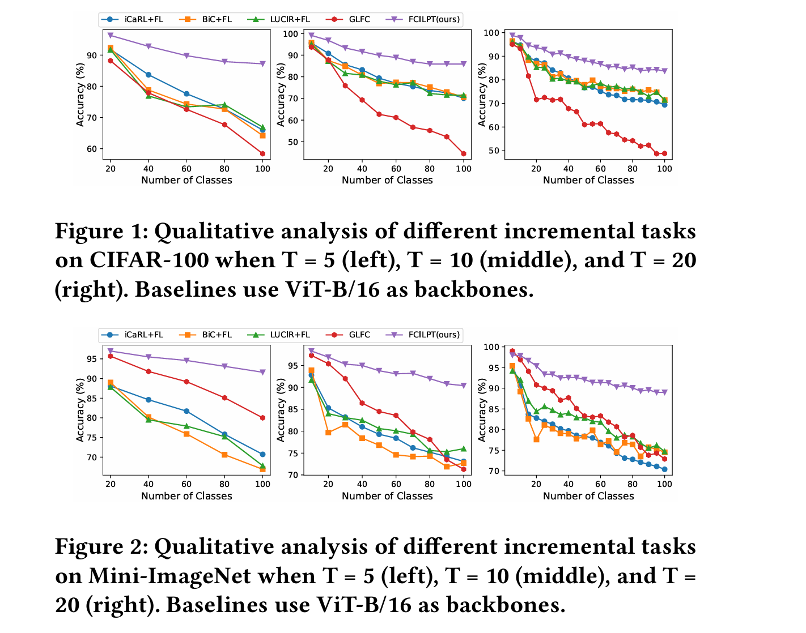

Biography
------
Welcome! I am currently in my final year as a Graduate student majoring in Artificial Intelligence at <a href="https://mima.sdu.edu.cn">MIMA</a> Lab, Shandong University, advised by Associate Professor <a href="https://faculty.sdu.edu.cn/luoxin/zh_CN/index.htm">Xin Luo</a>, co-advised by Professor <a href="https://faculty.sdu.edu.cn/xuxinshun/zh_CN/index.htm">Xin-Shun Xu</a>. Before that, I received my Bachelor’s degree in School of Information Science and Engineering, University of Jinan, Jinan, Shandong, China, in 2022, supervised by Associate Professor <a href ="http://2021.yzadm.ujn.edu.cn/Page/Dsxx/ssds_data/ssds_id/a8ba7dfc-7b89-18f8-af5c-5c4705349712/status/1.html">Peng Wu</a>, <a href ="http://2021.yzadm.ujn.edu.cn/Page/Dsxx/ssds_data/ssds_id/a8ba7dfc-7b89-18f8-af5c-5c4705349712/status/1.html">Jie Su</a>, and Professor [Xiuyang Zhao](https://ujnview.github.io/). I deeply appreciate the dedicated guidance and support.

My current research topics are **Machine Learning** and **Multimedia Retrieval**. I mainly focus on retrieval tasks, especially online hashing and image/cross-modal retrieval. Besides, I am also open and willing to explore other tasks, e.g., **vision-language models**, **LLMs**, test-time adaptation, incremental learning, prompt learning, and federated learning. 
 
**If you are interested in my topics, please do not hesitate to reach out.**
 

 I am currently seeking a PhD position for Fall 2025. If you're interested or have any opportunities available, feel free to drop me an email. 
 

My CV (Curriculum Vitae) can be found in [[new_CV](../ownhtml/Curriculum_Vitae_Chongyu_Zhang.pdf)] [[old_digital_CV](../ownhtml/cv_html_page.html)] .

News
------

<ul>
  <li>[07/2024] One paper is accepted by ACM MM 2024. </li>
  <li>[07/2023] One paper is accepted by ACM MM 2023. </li>
</ul>

Publications
------

<table style="width:100%">
  <tr>
    <th width="30%">
      
    </th>
    <th style="text-align:left" width="70%">
            Self-Distillation Dual-Memory Online Hashing with Hash Centers for Streaming Data Retrieval 
            Chong-Yu Zhang, Xin Luo, Yu-Wei Zhan, Peng-Fei Zhang, Zhen-Duo Chen, Yongxin Wang, Xun Yang, Xin-Shun Xu 
            ACM International Conference on Multimedia (<strong>ACM MM</strong>), 2023. 
            [<a href="https://doi.org/10.1145/3581783.3612119">Paper</a>][<a href="https://github.com/ZCyueternal/SDOH-HC">Code</a>][<a href="../proj/23-SDOH-HC-MM/index.html">Project</a>]
            <!--[<a href="https://www.baidu.com/">Youtube Video</a>][<a href="https://www.baidu.com/">Bilibili Video</a>]-->
    </th>
  </tr> 
</table>

<table style="width:100%">
  <tr>
    <th width="30%">
      
    </th>
    <th style="text-align:left" width="70%">
            FedCAFE: Federated Cross-Modal Hashing with Adaptive Feature Enhancement 
            Ting Fu, Yu-Wei Zhan, Chong-Yu Zhang, Xin Luo,  Zhen-Duo Chen, Yongxin Wang, Xun Yang, Xin-Shun Xu 
            ACM International Conference on Multimedia (<strong>ACM MM</strong>), 2024. 
            [<a href="https://doi.org/10.1145/3664647.3681319" target="_blank">Paper</a>][<a href="https://github.com/FtAhub/FedCAFE" target="_blank">code</a>]
    </th>
  </tr> 
</table>

<table>
<tr>
    <th width="30%">
      
    </th>
    <th style="text-align:left" width="70%">
            Federated Class-Incremental Learning with Prompting 
            Jiale Liu, Yu-Wei Zhan, Chong-Yu Zhang, Xin Luo, Zhen-Duo Chen, Yinwei Wei, Xin-Shun Xu 
            arxiv, 2023.
             
            
            [<a href="https://arxiv.org/pdf/2310.08948.pdf">arxiv</a>]
    </th>
  </tr> 

</table>
